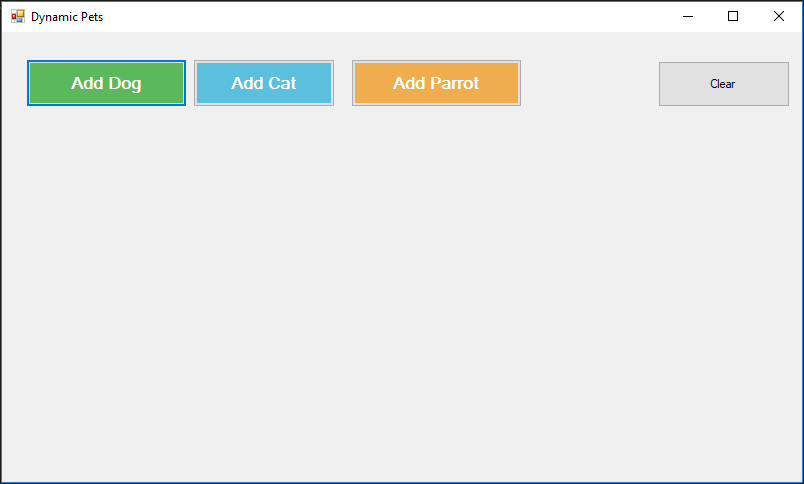
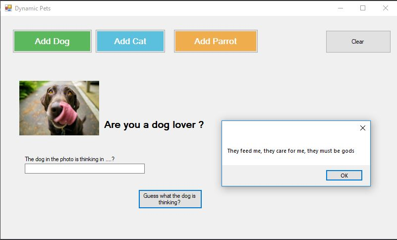
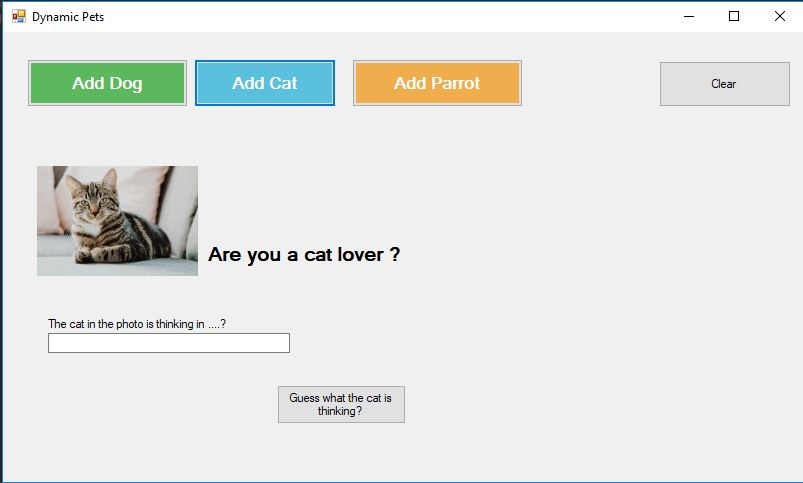
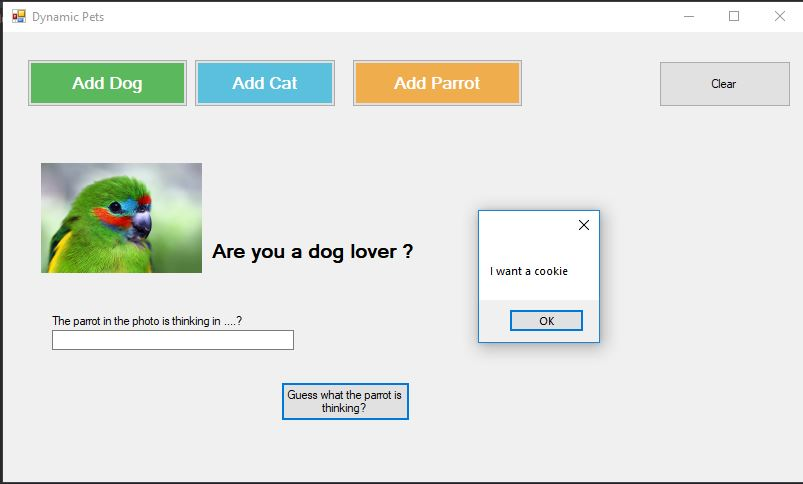

# Dynamic Pets

This windows forms sample shows an application with a Windows Forms 
and some user controls which are dynamically created and added.

This example is meant to display WebMap5 support for creating components and
adding and removing them.

The main screen is as follows:

You can add a dog by pressing the green button:

Press clear and now you can add a cat by pressing the light blue button:

Press clear and now you can add a parrot by pressing the orange button:

